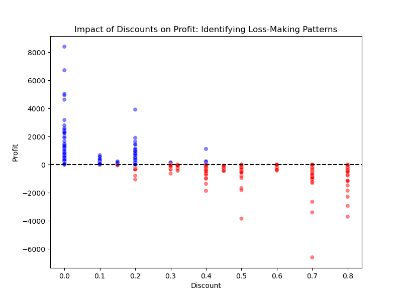
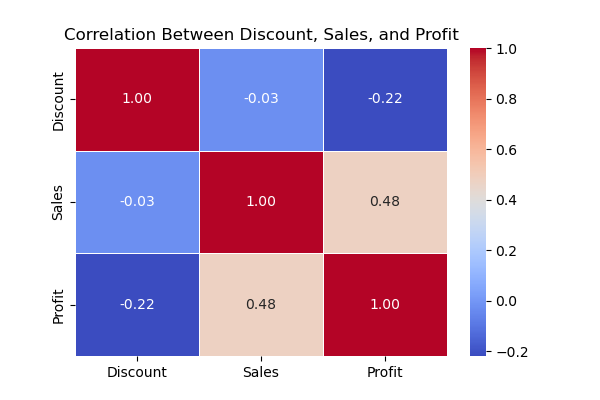
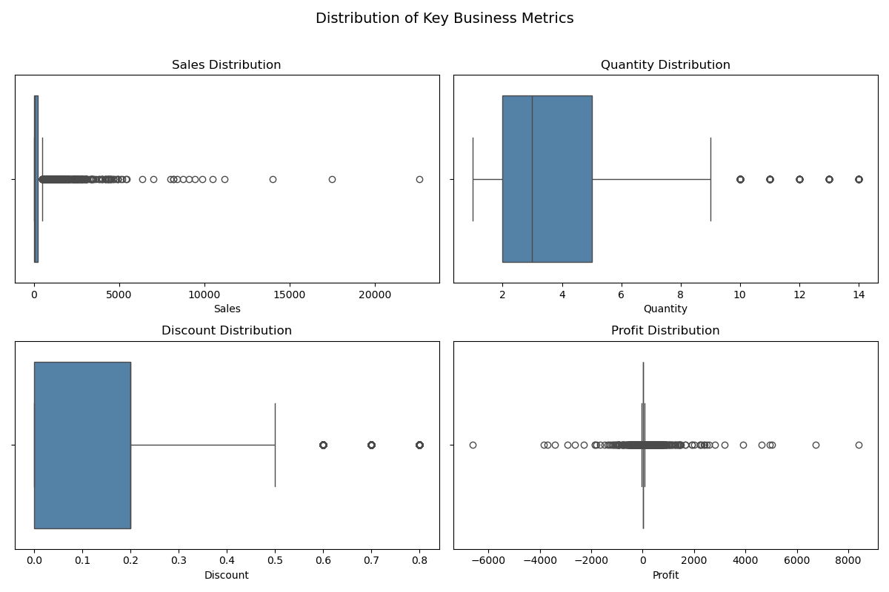

# **Superstore Sales Data Cleaning & Visualisation**

This repository contains a project focused on cleaning and transforming a messy **Superstore Sales Data** dataset. The dataset includes sales records from a retail business and contains issues such as missing values, duplicates, and inconsistent formatting. Additionally, after cleaning the data, visualisations were created to extract business insights.

---
## **Project Overview**

The objective of this project is to:
- **Clean and preprocess raw sales data** to make it analysis-ready.
- **Identify and remove duplicates** to ensure data integrity.
- **Handle missing values** using appropriate strategies.
- **Standardise formats** for dates and categorical variables.
- **Create a sample of data visualisations** to extract insights for business decision-making.

---
## **Dataset**

The dataset used in this project is the **Superstore Sales Data**, which contains key information about sales, customers, and product categories. Below are the containing columns:

- **Row ID**: A unique identifier for each row.
- **Order ID**: A unique identifier for each order.
- **Order Date**: The date on which the order was placed.
- **Ship Date**: The date on which the order was shipped.
- **Ship Mode**: The shipping method used for the order.
- **Customer ID**: A unique identifier for each customer.
- **Customer Name**: The name of the customer who placed the order.
- **Segment**: The customer segment (Consumer, Corporate and Home Office).
- **Country**: The country where the customer is located.
- **City**: The city where the customer is located.
- **State**: The state of the customer.
- **Postal Code**: The postal code of the customer's location.
- **Region**: The geographic region where the order was placed.
- **Product ID**: A unique identifier for each product.
- **Category**: The category of the product.
- **Sub-Category**: The sub-category of the product.
- **Product Name**: The name of the product.
- **Sales**: The total sales amount for the order.
- **Quantity**: The quantity of items in the order.
- **Discount**: The discount applied to the order.
- **Profit**: The profit made from the order.

---
## **Data Cleaning Process**

The following steps were undertaken to clean the dataset:
1. **Duplicate Removal**: Identified and removed any duplicate records.
2. **Handling Missing Values**: Imputed or removed missing values based on relevance.
3. **Standardisation**: Cleaned column names, reformatted date columns, and ensured consistency in categorical variables.
4. **Outlier Detection & Treatment**: Checked for extreme values in sales and profit columns.
5. **Feature Engineering**: Added new columns:
   - **Product ID Dup**: Identifies duplicated product IDs.
   - **Updated Product ID**: Adjusted identifier for product updates.
   - **Shipping Duration**: Number of days between order and shipping dates.
6. **Data Types**: Ensured proper data types (e.g., numerical, categorical, dates) for each column.

---
## **Data Visualisation**

After cleaning the data, visualisations were created to extract key business insights. 

This includes:

📊 **Metrics Distributions**: Distribution of key metrics.  
📌 **Profit Distribution**: Understanding profitability by category and region.  
📉 **Discount vs. Profit Analysis**: Evaluating the impact of discounts on profit.  

For a  more detailed analysis and conclusions, check out the **[Data Visualisation Notebook](notebooks/03-Data_Visualisation.ipynb)**.

### **Key Visualisations**

#### **Discount vs. Profit Relationship**

#### **Correlation Heatmap**

#### **Boxplot of Key Metrics**

---
## **Technologies Used**

- **Python** (Pandas, NumPy, Matplotlib, Seaborn)
- **Jupyter Notebook** (for interactive data analysis)
- **Git & GitHub** (for version control and collaboration)
- **File Formats**:
   - **CSV**: Standard data storage format.
   - **JSON**: Used for metadata storage.
   - **Parquet**: Optimised for large-scale data processing.
   - **Pickle**: For storing Python objects efficiently.

---
## **Project Files & Structure**

📂 **data/** → Contains raw, processed, and cleaned data.  
📂 **notebooks/** → Jupyter Notebooks for data exploration, cleaning, and visualisation.  
📂 **scripts/** → Python scripts for data processing automation.  
📂 **superstore_sales/** → Configuration and reusable functions.  

Key Notebooks:
- [**Data Cleaning Notebook**](notebooks/02-Data_Cleaning.ipynb)
- [**Data Comparison (Raw vs Cleaned)**](notebooks/data_comparison_raw_vs_clean.ipynb)
- [**Data Visualisation Notebook**](notebooks/03-Data_Visualisation.ipynb)

---
## **Results & Key Insights**

✔ **Data is fully cleaned and formatted for analysis.**  
✔ **Duplicate records were removed, and missing values were handled.**  
✔ **Standardised date formats and categorical data.**  
✔ **Business insights extracted through visualisations.**  

---
## **Summary**
The dataset is now cleaned, structured, and well-prepared for advanced analysis or dashboard creation. This thorough data cleaning process ensures that the dataset is reliable and accurate, offering a solid foundation for data-driven decision-making and future analyses. It’s a powerful reminder of how critical data cleaning is to ensure meaningful insights and impactful results.

---
## **License**

This project is licensed under the MIT License - see the [LICENSE](LICENSE) file for details.

